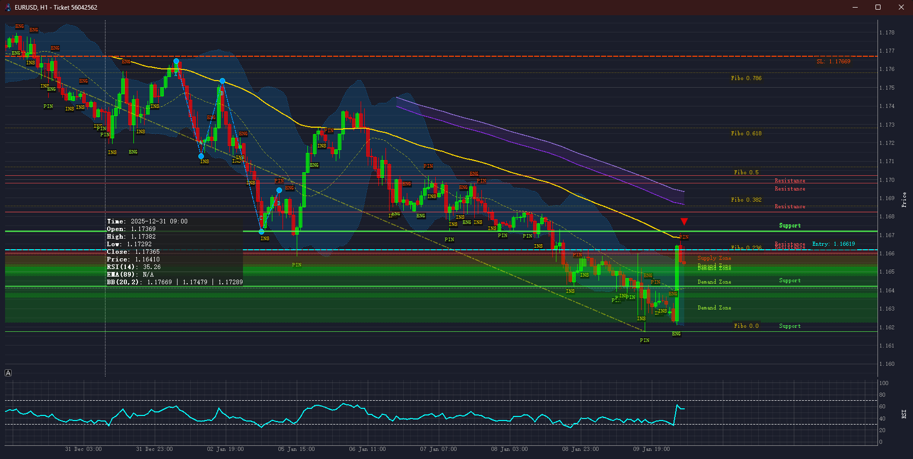
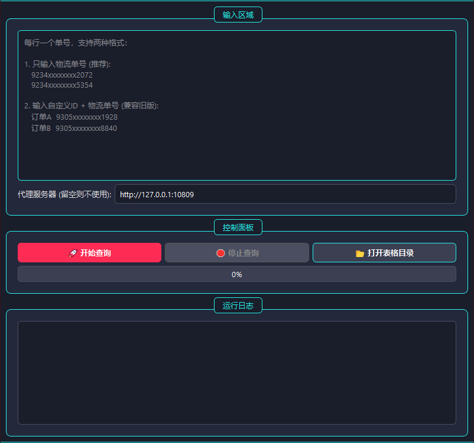
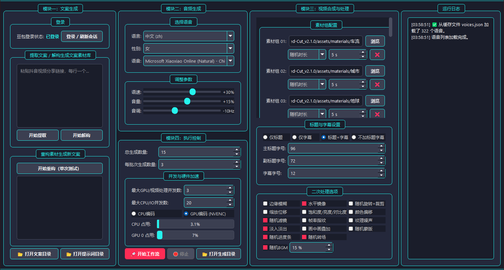
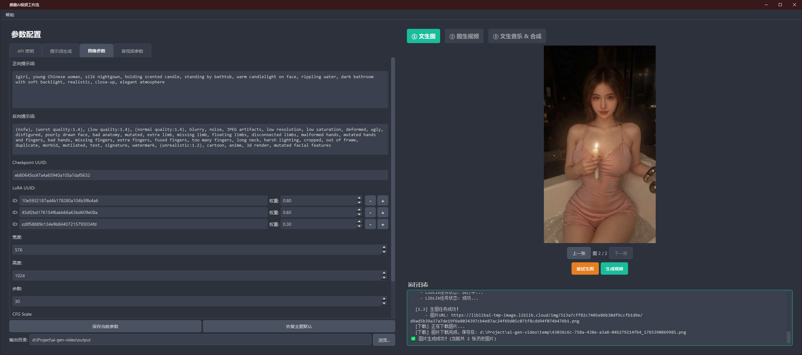
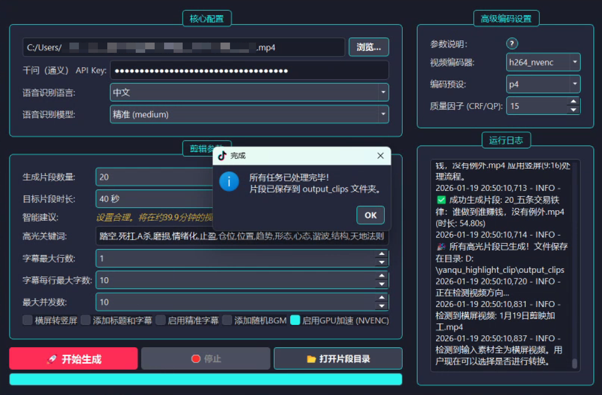
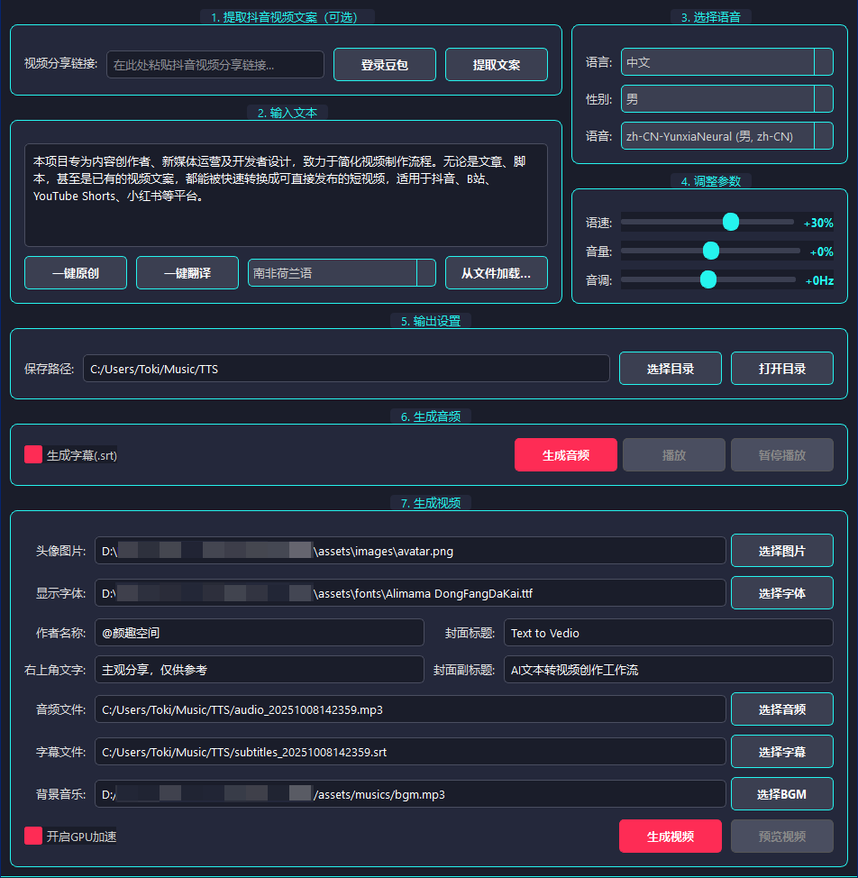

<!-- 1. Header Banner -->

  

  <h1>👋 Hi there, I'm Toki</h1>
  
<strong>前四大 (KPMG) 网络安全顾问 | Python自动化解决方案专家</strong>

  
🚀 专注于为自媒体、电商、金融等领域提供降本增效的定制化工具，聚焦 AIGC+自动化 领域

<!-- Social Links -->

  
  
  
  

---

<!-- 2. My Tech Stack -->
<h2 align="center">🛠️ 技术栈 | My Tech Stack</h2>

  
  
  
  
  
  
  

---

<!-- 3. My Open Source Projects -->
<h2 align="center">🚀 我的作品展 | My Project Gallery</h2>

每一个项目都是为了解决一个真实世界的问题而精心打造的。

<!-- Project Card 1: AI-Trader-For-MT4 -->
<table align="center" width="800">
  <tr>
    <td align="center">
      
        
      <h3><a href="https://github.com/toki-plus/ai-trader-for-mt4" target="_blank">🤖 AI Trader For MT4</a></h3>
      
革命性开源框架，将大语言模型（LLM）转变为能在MetaTrader 4（MT4）平台上进行自主交易的AI代理。

      

        
        
        
        
      

    </td>
  </tr>
</table>

---

<!-- Project Card 2: Auto USPS Tracker -->
<table align="center" width="800">
  <tr>
    <td align="center">
      
        
      <h3><a href="https://github.com/toki-plus/auto-usps-tracker" target="_blank">🚚 Auto USPS Tracker</a></h3>
      
专为跨境电商卖家设计的高效USPS批量物流追踪器，支持防屏蔽抓取并生成精美Excel报告。

      

        
        
        
        
      

    </td>
  </tr>
</table>

---

<!-- Project Card 3: AI Mixed Cut -->
<table align="center" width="800">
  <tr>
    <td align="center">
      
        
      <h3><a href="https://github.com/toki-plus/ai-mixed-cut" target="_blank">🧬 AI Mixed Cut</a></h3>
      
通过“解构-重构”模式解析爆款视频，建立创作素材库，并全自动生成全新原创短视频。

      

        
        
        
        
      

    </td>
  </tr>
</table>

---

<!-- Project Card 4: AI Video Workflow -->
<table align="center" width="800">
  <tr>
    <td align="center">
      
        
      <h3><a href="https://github.com/toki-plus/ai-video-workflow" target="_blank">🎬 AI Video Workflow</a></h3>
      
全自动AI原生视频生成工作流，集成文生图、图生视频和文生音乐模型，一键创作AIGC短视频。

      

        
        
        
        
      

    </td>
  </tr>
</table>

---

<!-- Project Card 5: AI Highlight Clip -->
<table align="center" width="800">
  <tr>
    <td align="center">
      
        
      <h3><a href="https://github.com/toki-plus/ai-highlight-clip" target="_blank">✨ AI Highlight Clip</a></h3>
      
AI驱动的智能剪辑工具，全自动从长视频分析、提取“高光时刻”，并生成爆款标题。

      

        
        
        
      

    </td>
  </tr>
</table>

---

<!-- Project Card 6: AI TTV Workflow -->
<table align="center" width="800">
  <tr>
    <td align="center">
      
        
      <h3><a href="https://github.com/toki-plus/ai-ttv-workflow" target="_blank">📝 AI TTV Workflow</a></h3>
      
AI驱动的文本转视频工具，自动将文案转化为带配音、字幕和封面的短视频，支持文案提取/二创/翻译。

      

        
        
        
      

    </td>
  </tr>
</table>

---

<!-- Project Card 7: AB Video Deduplicator -->
<table align="center" width="800">
  <tr>
    <td align="center">
      
        
      <h3><a href="https://github.com/toki-plus/AB-Video-Deduplicator" target="_blank">🔍 AB Video Deduplicator</a></h3>
      
创新“高帧率抽帧混合”技术，重构视频数据指纹，规避短视频平台原创度检测/查重机制。

      

        
        
        
      

    </td>
  </tr>
</table>

---

<!-- Project Card 8: Video Mover -->
<table align="center" width="800">
  <tr>
    <td align="center">
      
        
      <h3><a href="https://github.com/toki-plus/video-mover" target="_blank">📥 Video Mover</a></h3>
      
全自动化内容创作流水线，自动监听下载视频、多维度去重、AI生成标题，一键发布多平台。

      

        
        
        
      

    </td>
  </tr>
</table>

  

---

<!-- 4. GitHub Stats -->
<h2 align="center">📊 GitHub 统计 | My GitHub Stats</h2>

  
  

---

<!-- 5. Contact Me -->
<h2 align="center">📞 技术交流 | Let's Connect</h2>

  欢迎添加我的微信或关注公众号，获取最新技术分享与项目更新。

  <table align="center" style="border: none; background: transparent;">
    <tr>
      <td align="center" style="border: none; padding: 0 20px;">
        
         
        <b>个人微信</b>
         
        toki-plus (备注“GitHub”)
      </td>
      <td align="center" style="border: none; padding: 0 20px;">
        
         
        <b>公众号</b>
         
        最新技术与项目分享
      </td>
    </tr>
  </table>

<!-- Footer -->

  

  

